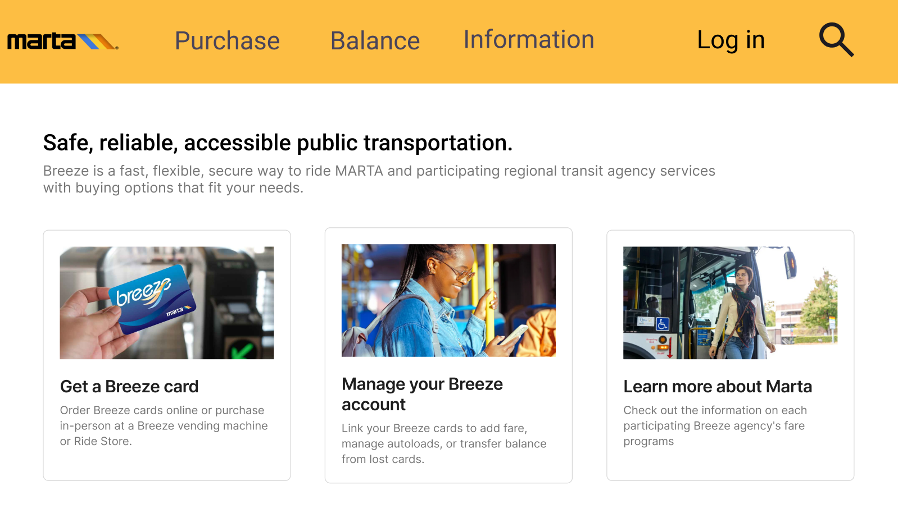
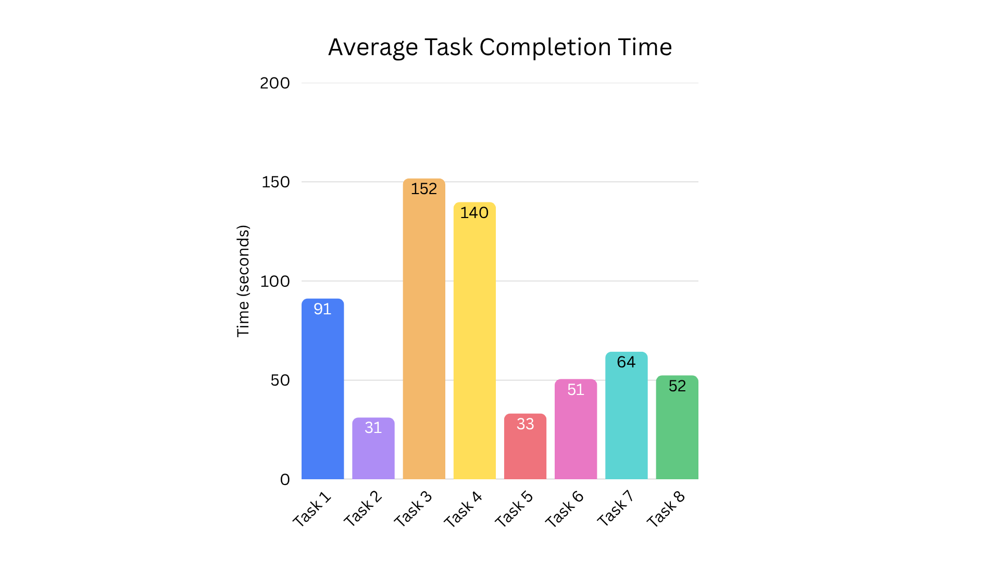
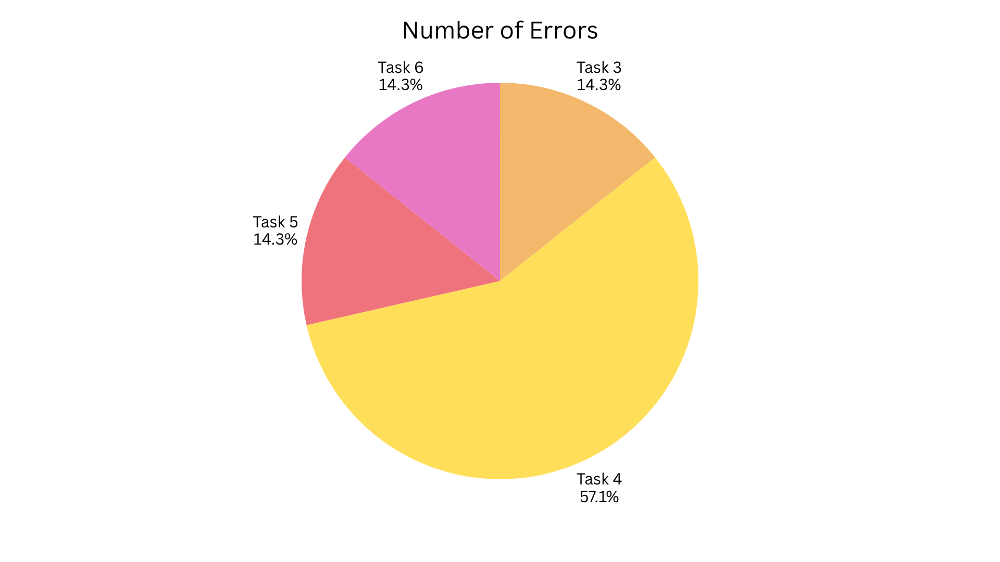
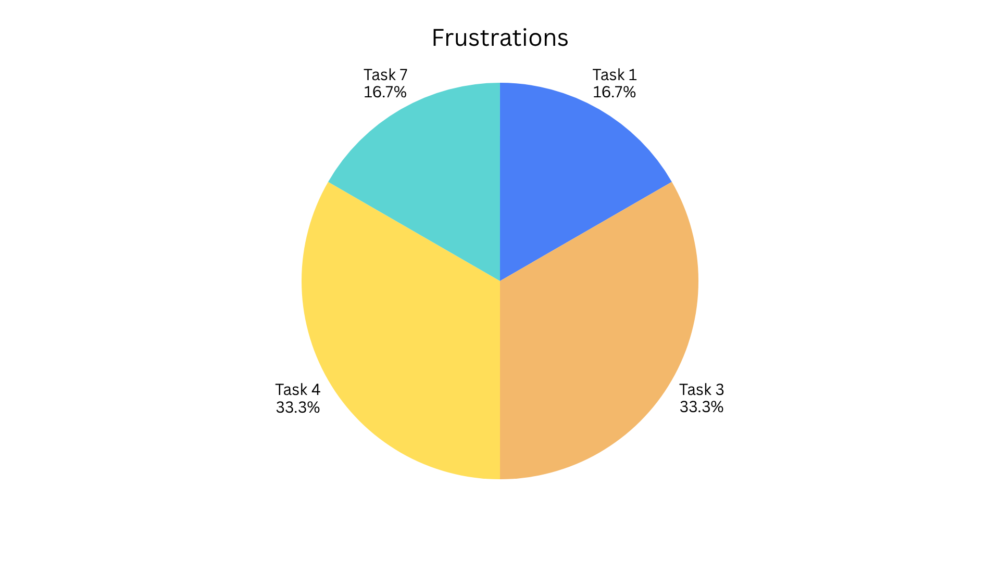
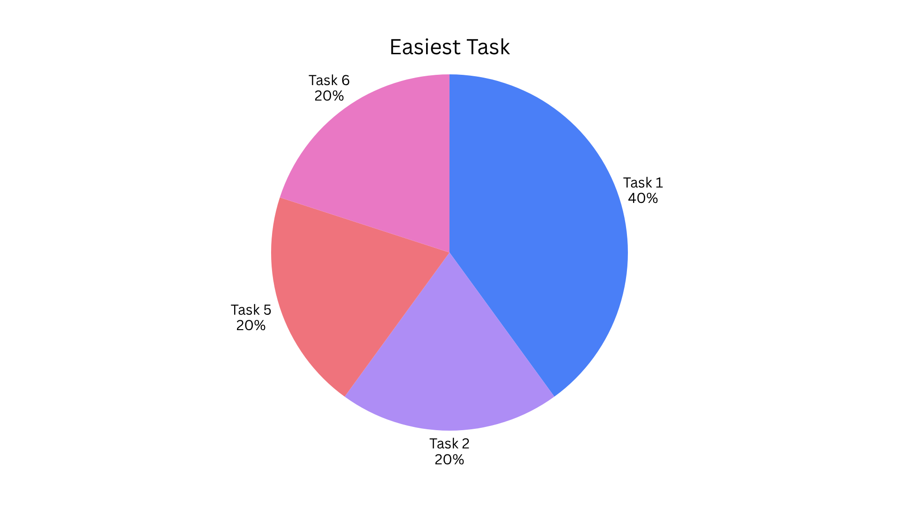
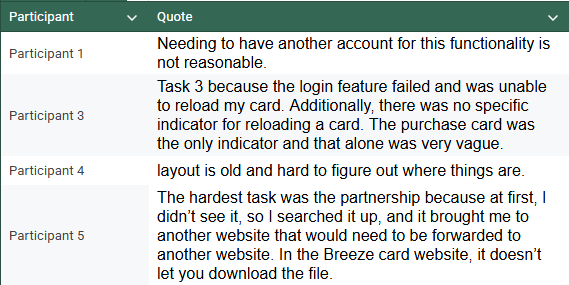
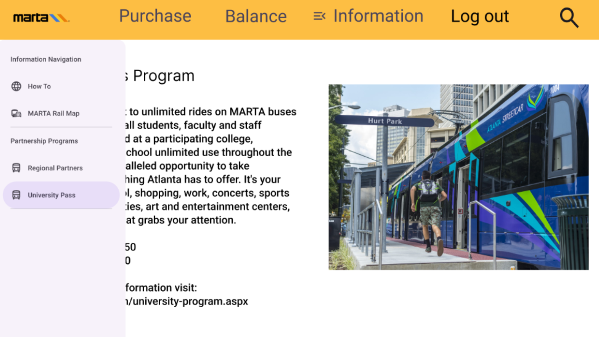

[Home](index.md) | [Data](data.md) | [Recommendation](recommendation.md)

---

## Methodology

To test the usability of existing Breeze Card website, we conducted usability testing with five participants who had prior experience using MARTA’s transit system. Participants were recruited to reflect a range of familiarity with the website to capture first impression and reengagement experiences. Tests were conducted both in-person and virtually, with all interactions recorded via Microsoft Teams to allow for reviewing and analysis. 

Prior to testing, participants completed a pre-test questionnaire to establish a baseline context. This questionnaire captured how frequently each participant uses MARTA, their typical ticketing method, whether they had previously visited the Breeze Card website, and whether the current payment system had every discouraged them from using MARTA. These responses helped contextualize individual performance and discover any prior familiarity that might influence task completion.  

After pre-task questionnaires, each participant was asked to complete eight tasks representative of common user experiences on the Breeze Card website. These tasks ranged from checking an existing card balance and expiration date, to find a route map, adding funds to a card, bulk ordering cards for a group, purchasing a replacement card, and discover program-specific information such as the University Pass Program and the MARTA Partnership Program. Finally, locate instructions for using a vending machine to reload a card balance. Throughout testing, two primary metrics were tracked: the time taken to complete each task and the number of errors encountered during each task.  	Participants were asked post-task questionnaires after their completion of all tasks. They responded to nine questions. This gathered qualitative impressions of the overall experience, asking them to reflect on which tasks felt the most challenging, most intuitive, or most time consuming. Post-questionnaires also ask for their view of the website’s layout, standout features, potentially unnecessary features, and likelihood of future use.

## Findings

The usability test with five participants showed several critical issues with the Breeze Card website. The most significant problem was the bulk ordering feature, which required users to log in to a separate account without any clear indication beforehand. Four out of five participants encountered this difficulty during their bulk ordering task. Two participants reported that this task was the most frustrating task. One of the participants shared that “Needing to have another account for this functionality is not reasonable.” 

A second critical issue was the difficulty to locate specific information on the website. Tasks such as finding the University Pass Program details and the Perimeter Center Partnership sign up required participants to navigate through multiple layers of menus and pages as the buttons for this information were too small to intuitively spot them. One of the participants said, “The hardest task was the partnership because at first, I didn’t see it, so I searched it up, and it brought me to another website that would need to be forwarded to another website. In the Breeze card website, it doesn’t let you download the file.” Even after navigating to the detailed information page, the instructions were not very clear. Task 7’s completion time ranged from 10 seconds to 164 seconds, meaning that success depended heavily on chance navigation rather than clear information architecture. 

The process of adding funds and purchasing a new card also revealed to be more complicated than expected. Task 3, adding $10 to a card had the highest average completion time of all tasks at around 152 seconds, and two participants required over 240 seconds. Two participants reported that this task was the most frustrating task. One of the participants reported to the hardest task, “Task 3 because the login feature failed and was unable to reload my card. Additionally, there was no specific indicator for reloading a card. The purchase card was the only indicator and that alone was very vague.” Even with task 5, purchasing a replacement card, while quick on average, one participant had an error.  

All of the participants commented on the website’s outdated visual design and interface. The dense blocks of text, small text, and navigation menus that did not account for modern web conventions, making it difficult to glance at pages quickly or locate buttons. One of the participants shared that “layout is old and hard to figure out where things are.” Some of the usability difficulties discussed previously were due to the UI issue. 

These findings point to four main usability issues: a broken bulk ordering flow that requires secondary login, poor information architecture to navigate, a complex card purchasing and reloading process, and an outdated UI that discourages user’s navigating skill. We aimed to directly address these issues in our new design.

<figure>
  
  <figcaption>Figure 1: Average Task Completion Time</figcaption>
</figure>

<figure>
  
  <figcaption>Figure 2: Number of Errors</figcaption>
</figure>

<figure>
  
  <figcaption>Figure 3: Frustraitons</figcaption>
</figure>

<figure>
  
  <figcaption>Figure 4: Easiest Task</figcaption>
</figure>

<figure>
  
  <figcaption>Figure 5: Quotes from Participants</figcaption>
</figure>

## Analysis
As seen in the findings, there were several issues that we had found with the website, including bulk ordering, information overload, outdated UI, and seperate logins. These issues make the experience of using the Breeze card website worse than it could have been. Even though each of them was not a horrible time sink, the combination of each forced the user to spend more time than would be acceptable on simple tasks and getting information. 

Our first major issues with the breeze card website was bulk ordering. As seen in both Figure 2 and Figure 3, 33% of the most frustration was in task 4 as well as 57% of the errors. Having an entirely different login to bulk order was as one of the users put “not reasonable”. To fix this issue, we merged the 2 accounts, connecting the breeze card to the user, and when they were to sign in, they can see all the information about the card such as Balance, Remaining Trips, Remaining passes, and Expiration Date. Because in the initial website design, the purchasing of group orders was separate from buying for individuals, which led to a lot of confusion on the users' side, we decided to make it easier by merging the individual purchasing and the group purchasing. 

As seen in the findings previously, an issue that we needed to address was the difficulty of finding specific information such as the University Pass Program details, and the Perimeter Center Partnership to sign up. A user was unable to find the partnership on the website, so they were forced to look it up online, which brought them to a different website from the breeze card website. One of the participants marked the task of trying to find information about the Programs as the hardest because once going into the purchase page it was not clear on how to leave it and go back to the home. To fix this problem, we decided to add a dedicated information section, and a tab that extends with all the information that a user would need. In Figure 6, you can see how the Information tab is extended with clear details on each tab, fixing the issue with the user unable to find it and trying to look up the information on another website.  

The outdated UI was a major eye sore to the users, which exacerbated the other technical issues the user had to deal with. All the participants commented on how the website had not been properly updated in a while, with small text, major amounts of unused space, as well as misleading buttons. We made a full overhaul to the website, with easier to follow flows and updated UI. As seen in Figure 6, we have a new header with all the relevant information one would need, as well as larger text which uses the full screen instead of half the page being left blank.  

2 out of our 5 participants marked Task 3 as the hardest, as well as it having the largest average Time to completion compared to the other tasks. Only 2 of our participants were able to add 10 $ to their card in sub 100 second time, while 2 other participants had a time of nearly 3 minutes. This being one of the easier tasks was unacceptable because this would be a regular task that one needs to do to ride the bus. As a fix, we added the section in the header so that the user has a clear and easy button to click on to add money to their card. In addition to being able to add money in this section, they would also be able to buy passes and group orders, which fixes our other issue of separate logins. 
<figure>
  
  <figcaption>Figure 6: Informations page</figcaption>
</figure>
