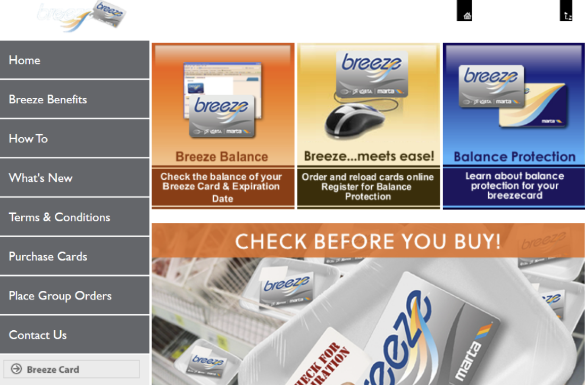
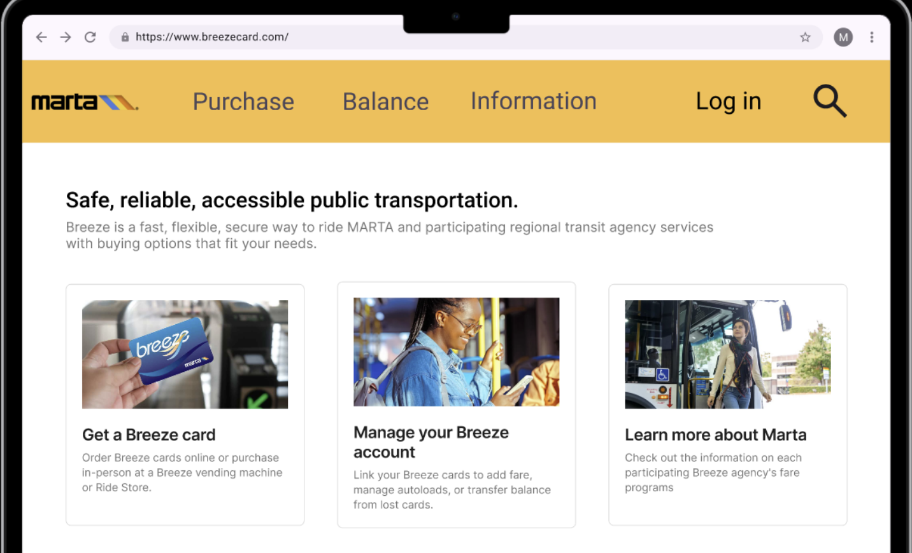
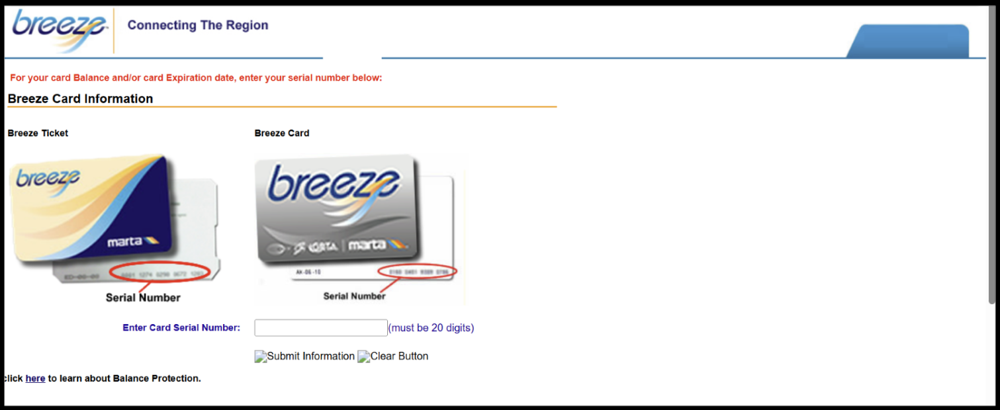
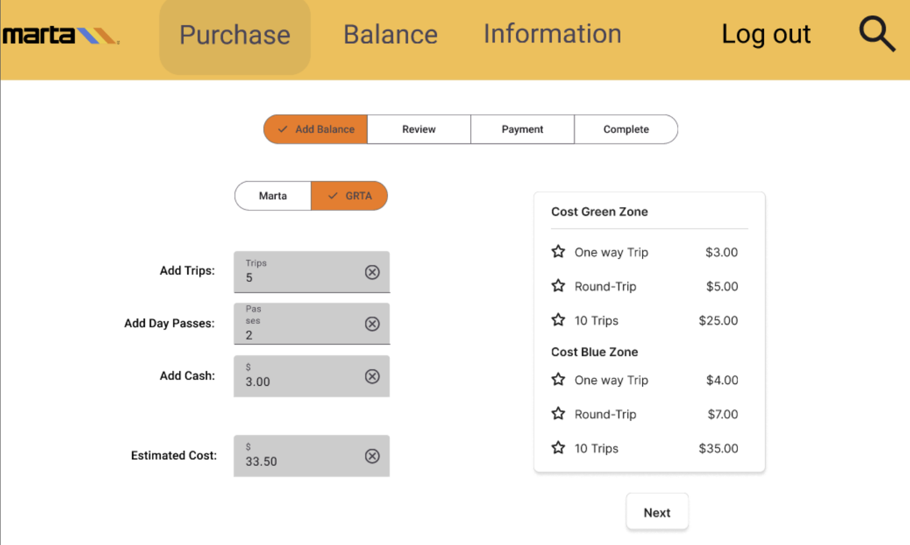
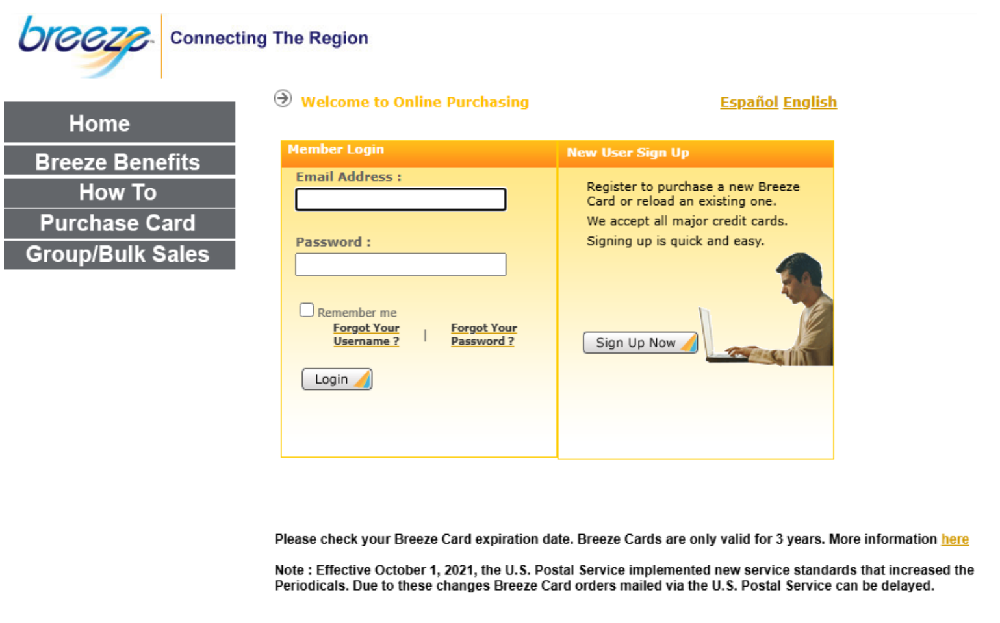
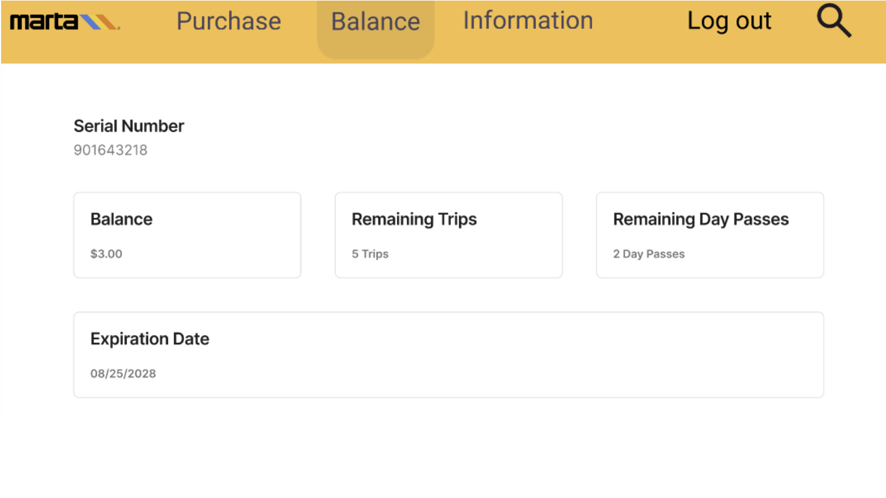
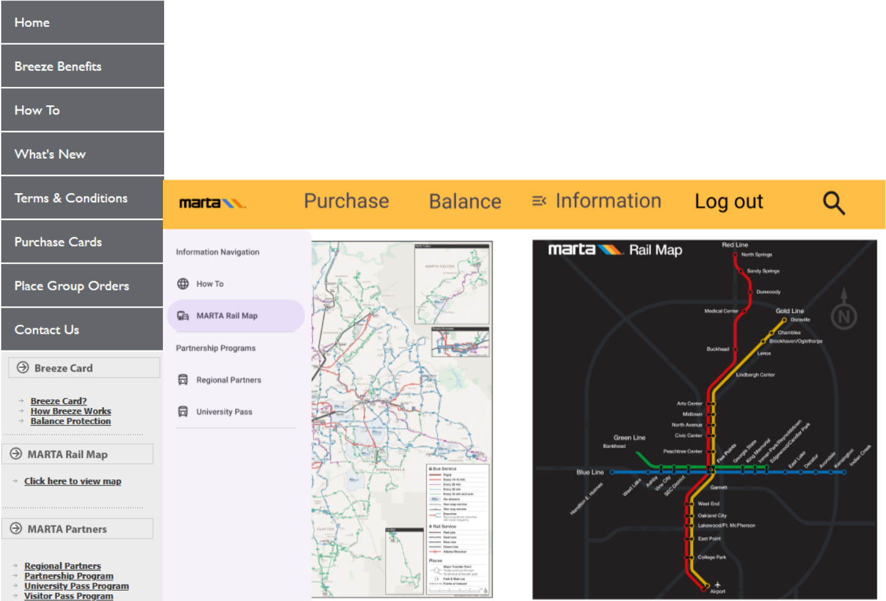

[Home](index.md) | [Data](data.md) | [Recommendation](recommendation.md)

---

## Recommendation

All our recommendations branch off one main critique. The website, while being updated recently, still has the aesthetic of a 2005 website. The User Interface is clunky; the User Experience is unintuitive, and the backend is slow or simply unresponsive. The entire website requires a major overhaul, four aspects of which, we will recommend. 

Let’s start with the home page first.  

We added a border on this image to fully illustrate how much whitespace there is. This layout is clearly not designed for modern day monitors. The top bar is nonfunctional, if you look closely there is a home button, it doesn’t work. Instead, to go back to this page from any other page, the user must click on the Breeze Card Logo, which is transparent and hard to see as a result. Beyond these two obvious flaws, the home page is overwhelming with information. There is no ordered of buttons on the left in terms of popularity; (we highly suspect that the number of people reading the Terms and Conditions cannot be higher than the number of people looking to purchase a Breeze Card). We overhauled this home page to focus on showing users what they want. Most users, from our usability testing, mentioned that their main use-case for breezecard.com was to purchase funds or view their balance. Thus, we made these the center-piece of the website. All other information, can be easily accessible from the information tab. However, since most visits never go to those pages, there is no need to clutter the home page with endless options. Our design is pictured below. 

Moving on, to one of the main functionalities of breezecard.com: purchasing cards and refueling cards. 

Again, this page struggles from the display issues. The bigger problem here is that once a user is logged in, all the options are listed. There is no ordering or estimated total shown and it can get confusing to figure out what a user is purchasing. This is why we ensured that we categorized all purchases by type. 

We have also made it easy, instead of selecting options such as 1 ticket, 2 tickets, 5 tickets, etc. Users can now have the freedom to select as many tickets, passes, or cash they’d like and prices are listed on the side and total estimated cost is listed below. Purchasing funds is now also a multi-step process. With a review section, a clear payment screen, and a receipt screen. This makes is abundantly clear to the user when they are shopping and when they are purchasing. The current system takes multiple days until purchases are registered to users, in a full website overhaul, we would also decrease the latency of this down to a few minutes. The infrastructure of this already exists in other mass transit systems and also with the refueling funds at the MARTA Station itself, there is no reason for a massive delay for online purchases. 

Another main use-case for breezecard.com would be an online way to check a user’s balance. Currently on the MARTA page, you need to log-in and then a single number with the amount of funds the user has is listed. This number is not very helpful unless broken down into trips and day passes. 

Thus we suggest to do that in our website overhaul shown below.

So, we have discussed all the major pages on breezecard.com. To recap, that would be the home page, the balance page, and the purchase page. However, a non-insignificant poriton of users also mention using this website to scroll through all its information about MARTA services. In the home page, we suggested pigeonholing all this information elsewhere since most users do not need this information. We believe that good UI/UX design requires giving the user exactly what they are looking for and nothing more. This is why we chose to take all the information off the home page, since most users do not have a desire for that. The same logic applies for our information page. Rather than giving a laundry list of every single page and policy on MARTA, we choose to employ drop down menus and intuitive categorization of topics. This way, while it may take more clicks to get to a specific page (Example: Home Page à Information Page à Pass Programs à University Pass Programs vs. Home Page à University Pass Programs), each page only has a few options. This decreases the cognitive load for the user since they do not need to do a search through a list of maybe 35 pages and can instead scan maybe 3 or 4 topics and then select the correct categorization intuitively. This will save time for the average user who is unfamiliar with the breezecard.com website, which most users will be as it is not a regularly used site.  

Here is a comparison side-by-side of before menu vs. our new categorization menu. With this new menu it is easier to find exactly what you are looking for. 

While this is a short summary of our suggestions for the MARTA breezecard.com website, a full prototype of our suggested changes can be found at the following link: https://www.figma.com/proto/FlZZhznnzGohMO4kzQZyVs/Hi-Fi-Prototype?node-id=0-1&t=pntFjRv2vkmXKK1s-1 
